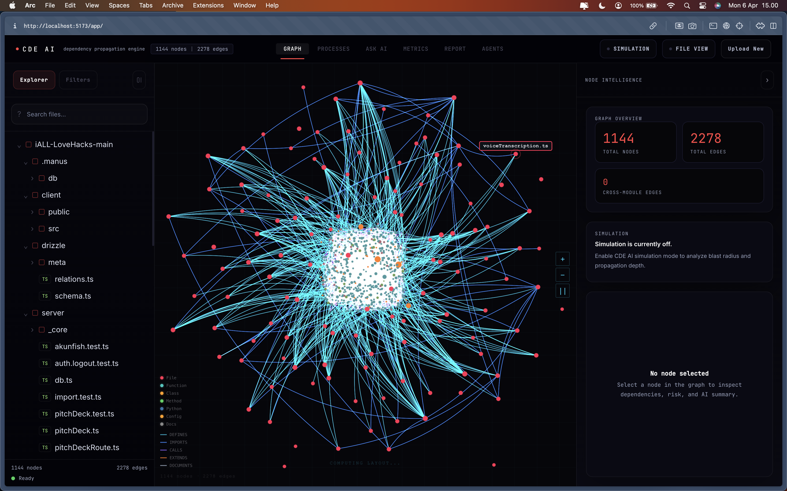
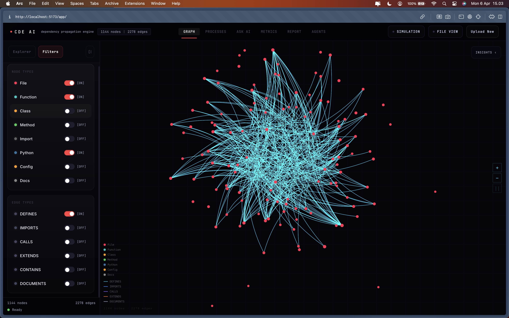
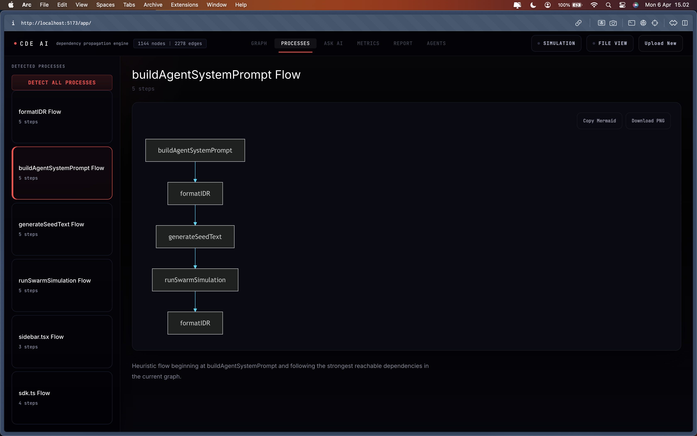
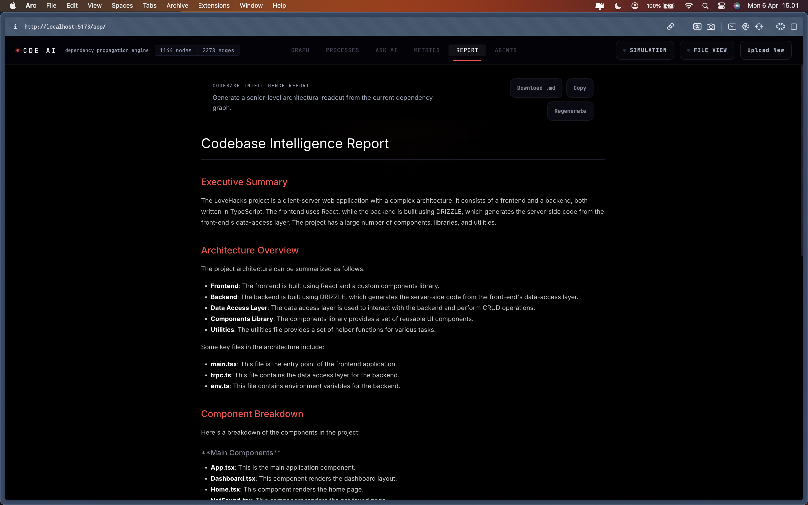
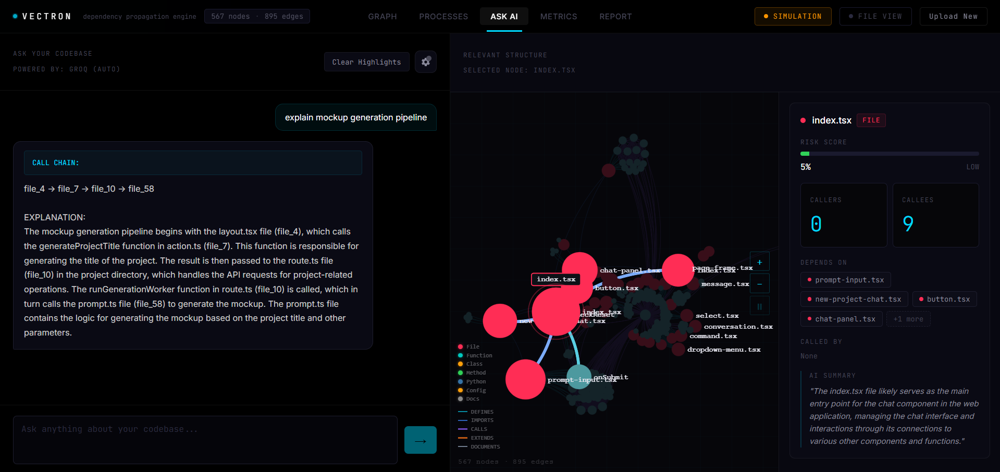
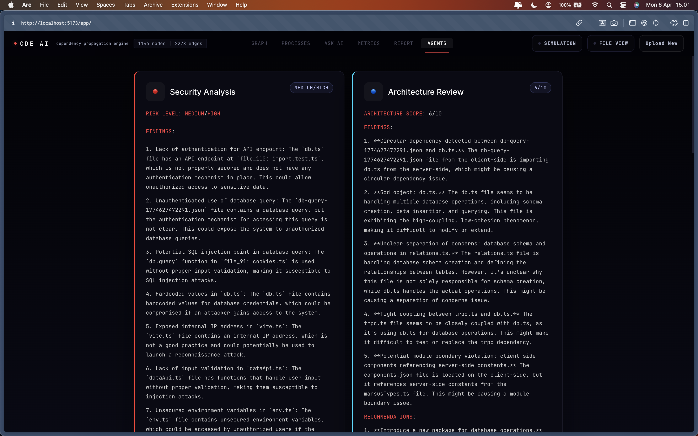
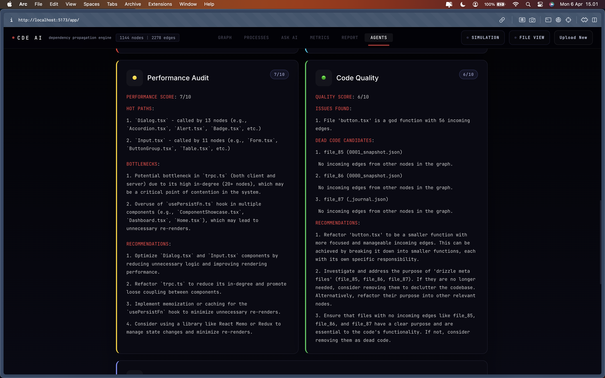
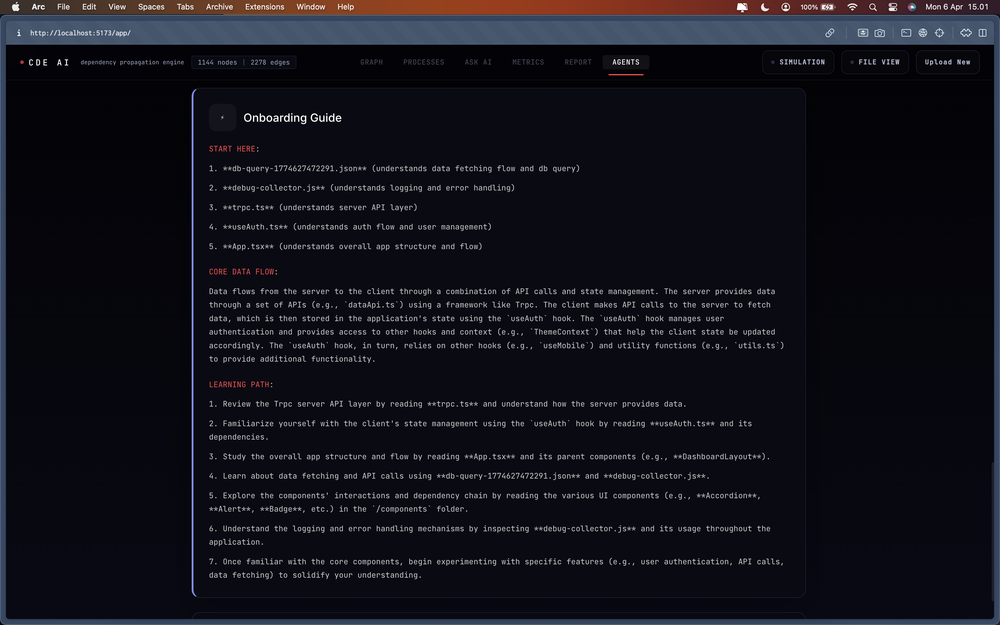
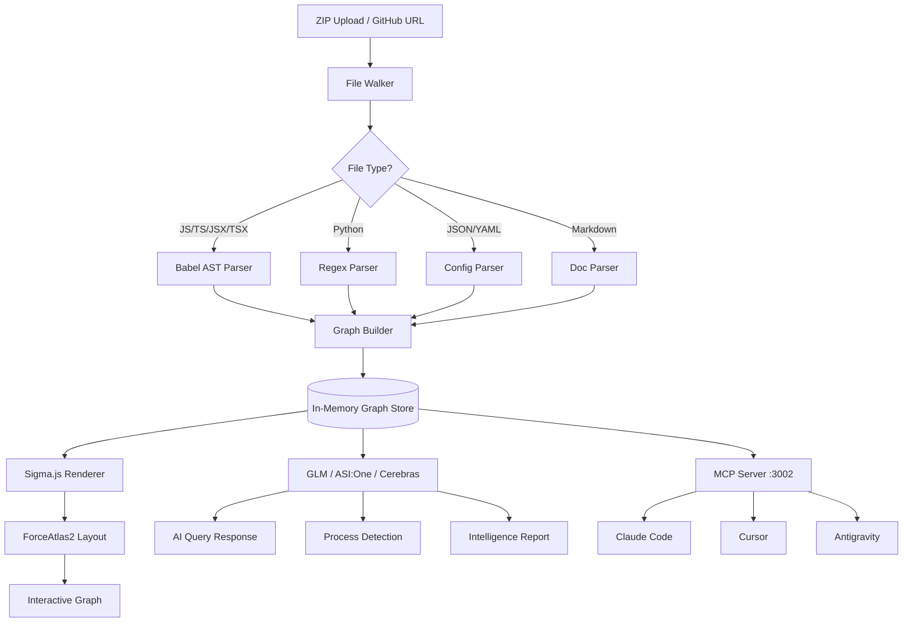
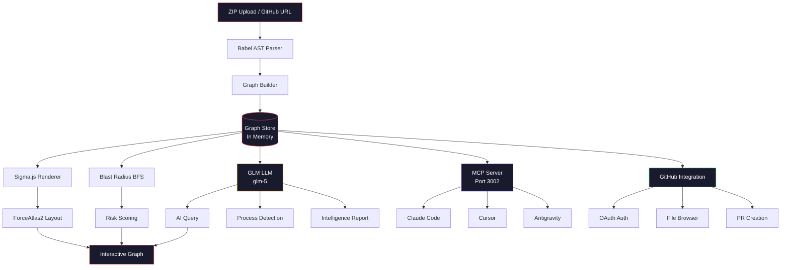

# CDE AI — Dependency Propagation Engine

---

## What is CDE AI?

CDE AI is an AI-powered codebase dependency explorer. Upload any JavaScript, TypeScript, or Python repository as a ZIP or paste a GitHub URL and instantly get an interactive knowledge graph of every file, function, class and their relationships.

The average developer spends **58% of their time understanding code, not writing it.** CDE AI eliminates that.

---

## Screenshots

### Graph View


### Blast Radius Simulation


### Process Flows


### Intelligence Report


### AI Query


### Multi-Agent Analysis
| | |
|---|---|
|  |  |
|  | |

---

## Features

### Blast Radius Simulation
Click any node in the graph. CDE AI instantly runs a BFS propagation to show every downstream dependency that breaks if you change it. Color-coded by impact depth — red is direct, orange is one hop, yellow is two hops.

### Interactive Dependency Graph
Render files, functions, classes, and methods as a live graph with structural edges. Powered by Sigma.js + Graphology with ForceAtlas2 layout. Filter by node type, edge type, or search for specific nodes.

### GitHub Integration
Connect your GitHub account via OAuth to access private repositories. Paste any public GitHub repository URL directly — no ZIP download needed. CDE AI clones and analyzes the repo instantly.

### AI Codebase Query
Ask anything about your codebase in plain English. CDE AI sends a compressed graph summary to GLM first, then falls back to ASI:One and Cerebras if needed, and returns a precise answer with a call chain while simultaneously highlighting the relevant nodes on the graph.

### Metrics Dashboard
- **Top 10 most connected nodes** — horizontal bar chart
- **Node type distribution** — stacked bar with per-type breakdown
- **Risk table** — sortable table with risk scores, connection counts, and status badges
- Identifies your most fragile code instantly

### Process Flow Detection
Automatically detects all execution flows in the codebase and generates Mermaid flowcharts for each one. Click any process to see the complete call chain visualized.

### Node Intelligence
Click any node to instantly see its complete intelligence profile:
- **Risk Score** — calculated from connection density
- **Callers & Callees** — exact count of incoming and outgoing dependencies
- **Depends On** — direct dependencies as visual pills
- **Called By** — everything that depends on this node
- **AI Summary** — one-line AI description of what the node does

### Codebase Intelligence Report
One click generates a full architecture document — executive summary, component breakdown, risk assessment, onboarding guide. Powered by GLM with ASI:One and Cerebras fallback.

### Multi-Agent Analysis
Five specialized AI agents analyze your codebase simultaneously:
- **Security Agent** — identifies vulnerabilities, exposed endpoints, authentication gaps
- **Architecture Agent** — detects circular dependencies, coupling issues, design pattern problems
- **Performance Agent** — finds hot paths, bottlenecks, expensive dependency chains
- **Code Quality Agent** — flags dead code, god functions, duplication
- **Onboarding Agent** — generates a learning path, explains core data flows

### Custom LLM Configuration
Bring your own API key. Configure any LLM provider directly in the UI:
- GLM (default, primary)
- ASI:One
- OpenAI
- Anthropic
- Cerebras
- Any OpenAI-compatible endpoint

### MCP Server — AI-Native Codebase Context
CDE AI runs as an MCP (Model Context Protocol) server on port 3002. Connect it to Claude Code, Cursor, or Antigravity and your AI coding assistant gets full dependency context while you code.

```json
{
  "name": "CDE AI",
  "url": "http://localhost:3002/sse",
  "type": "sse"
}
```

**Available MCP Tools:**

| Tool | Description |
|------|-------------|
| `cde-ai_status` | Check if a graph is loaded |
| `cde-ai_blast_radius(node, depth?)` | What breaks if I change this? |
| `cde-ai_get_callers(node)` | What calls this function? |
| `cde-ai_get_dependencies(node)` | What does this depend on? |
| `cde-ai_query(question)` | Ask anything about the codebase |

---

## How It Works



---

## Performance

| Codebase Size | Files | Parse Time | Nodes | Edges |
|---------------|-------|------------|-------|-------|
| Small | <50 files | ~2s | ~100 | ~200 |
| Medium | 50-200 files | ~5s | ~500 | ~1000 |
| Large | 200-500 files | ~10s | ~1300 | ~4000 |
| XL | 500+ files | ~20s | ~2000+ | ~8000+ |

---

## Quick Start

### Web (Instant)
Visit **[glm-hacks-production.up.railway.app](https://glm-hacks-production.up.railway.app)** and upload a ZIP or paste a GitHub URL.

### Local + MCP Setup
```bash
git clone https://github.com/maulana-tech/glm-hacks
cd glm-hacks/cde-app
pnpm install
pnpm run dev
```

Open `http://localhost:5173/app/` — upload a ZIP — then connect MCP:
```
http://localhost:3002/sse
```

### Environment Variables
```env
GLM_API_KEY=your_glm_key_here
ASI_ONE_API_KEY=your_asi_one_key_here
CEREBRAS_API_KEY=your_cerebras_key_here
GITHUB_TOKEN=optional_github_token
GITHUB_CLIENT_ID=your_github_oauth_client_id
GITHUB_CLIENT_SECRET=your_github_oauth_client_secret
GITHUB_REDIRECT_URI=https://your-domain.com/api/github/callback
PORT=3001
```

Get your free API keys:
- **GLM**: [open.bigmodel.cn](https://open.bigmodel.cn)
- **ASI:One**: [api.asi1.ai](https://api.asi1.ai)
- **Cerebras**: [inference.cerebras.ai](https://inference.cerebras.ai)
- **GitHub OAuth**: [github.com/settings/developers](https://github.com/settings/developers)

---

## Tech Stack

| Layer | Technology |
|-------|-----------|
| Frontend | React + TypeScript + Vite |
| Graph Rendering | Sigma.js + Graphology + ForceAtlas2 |
| Backend | Express.js + Node.js |
| AST Parsing | Babel (JS/TS/JSX/TSX) |
| AI Primary | GLM — `glm-5` |
| AI Fallback | ASI:One, then Cerebras |
| Process Diagrams | Mermaid.js |
| GitHub Integration | OAuth 2.0 + REST API |
| MCP Protocol | @modelcontextprotocol/sdk |
| Package Manager | pnpm |
| Deployment | Railway |

---

## API Reference

| Endpoint | Method | Description |
|----------|--------|-------------|
| `/api/upload` | POST | Upload ZIP file for analysis |
| `/api/clone` | POST | Analyze GitHub repo by URL |
| `/api/query` | POST | AI natural language query |
| `/api/processes` | POST | Detect process flows |
| `/api/report` | POST | Generate intelligence report |
| `/api/node-summary` | POST | Generate node-level AI summary |
| `/api/file` | GET | Fetch cached file contents by path |
| `/api/github/auth` | GET | GitHub OAuth redirect |
| `/api/github/callback` | GET | GitHub OAuth callback |
| `/api/github/me` | GET | Get authenticated GitHub user |
| `/api/github/files` | POST | List files in a GitHub repo |
| `/api/github/file` | GET/POST | Read/write GitHub file |
| `/api/github/branch` | POST | Create a GitHub branch |
| `/api/github/pr` | POST | Create a GitHub pull request |
| `/api/github/logout` | POST | Clear GitHub auth session |
| `/health` | GET | Server health check |

---

## Architecture



---

## Project Structure

```
cde-app/
├── client/                 # React + Vite frontend
│   └── src/
│       ├── components/     # UI components
│       │   ├── Header.tsx
│       │   ├── UploadZone.tsx
│       │   ├── GraphView2D.tsx
│       │   ├── MetricsDashboard.tsx
│       │   ├── MetricsPanel.tsx
│       │   ├── NodeIntelligence.tsx
│       │   ├── ExplorerPanel.tsx
│       │   ├── FilterPanel.tsx
│       │   ├── QueryPanel.tsx
│       │   ├── ProcessPanel.tsx
│       │   ├── AgentPanel.tsx
│       │   ├── ReportModal.tsx
│       │   └── CodeInspector.tsx
│       ├── lib/            # Utilities & API client
│       ├── types/          # TypeScript definitions
│       ├── App.tsx
│       └── index.css
├── server/                 # Express backend
│   └── src/
│       ├── index.ts        # API routes & server logic
│       └── landing.html    # Landing page
└── railway.json
```

---

## Contributing

1. Fork the repo and create a feature branch.
2. Run the client and server locally from `cde-app/`.
3. Keep changes scoped and verify with local builds before opening a PR.
4. Document any new endpoints, MCP tools, or UI workflows in the README.
5. Open a pull request with screenshots if the change affects the interface.

---

*Maintained by [@maulana-tech](https://github.com/maulana-tech)*