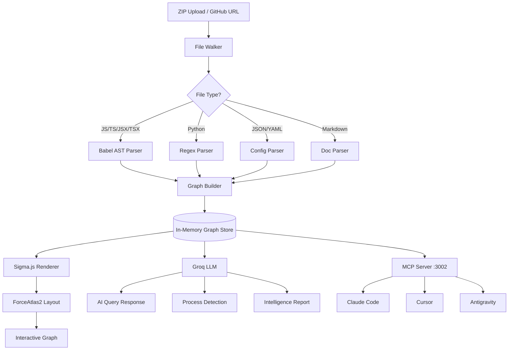

# CDE AI Architecture

## System Overview
CDE AI is a full-stack web application with three main layers:
- Client (React + Sigma.js)
- Server (Express + Babel AST)
- MCP Server (Model Context Protocol)

## Component Architecture



## Data Flow
1. User uploads ZIP or pastes GitHub URL
2. Server extracts and walks all files
3. Babel AST parser extracts nodes and edges
4. Graph builder assembles GraphData object
5. Graph stored in memory via graph-store singleton
6. Frontend receives GraphData and renders with Sigma.js
7. ForceAtlas2 layout algorithm positions nodes
8. User interactions trigger BFS blast radius calculations

## Key Design Decisions

### Why Babel over Tree-sitter?
Babel is battle-tested for JS/TS parsing and runs in Node.js
natively without WASM complexity.

### Why Sigma.js over D3?
Sigma.js uses WebGL rendering - handles 2000+ nodes at 60fps.
D3 SVG rendering struggles above 500 nodes.

### Why Groq over OpenAI?
Groq's LPU hardware delivers sub-second responses critical
for real-time graph highlighting. Cerebras provides fallback.

### Why in-memory over database?
For single-session analysis, in-memory is faster and simpler.
Future versions will add KuzuDB for persistence.

## File Structure
```text
vectron-app/
├── client/                 # React frontend
│   └── src/
│       ├── components/     # UI components
│       │   ├── GraphView2D.tsx    # Main Sigma.js renderer
│       │   ├── MetricsPanel.tsx   # Analytics dashboard
│       │   ├── ProcessPanel.tsx   # Mermaid flowcharts
│       │   ├── ReportPanel.tsx    # AI report generation
│       │   └── ...
│       └── types/          # TypeScript interfaces
└── server/                 # Express backend
    └── src/
        ├── index.ts        # Main server + API routes
        ├── parser.ts       # Babel AST parser
        ├── graph-builder.ts # Graph assembly
        ├── graph-store.ts  # In-memory singleton
        └── mcp-server.ts   # MCP SSE server
```
